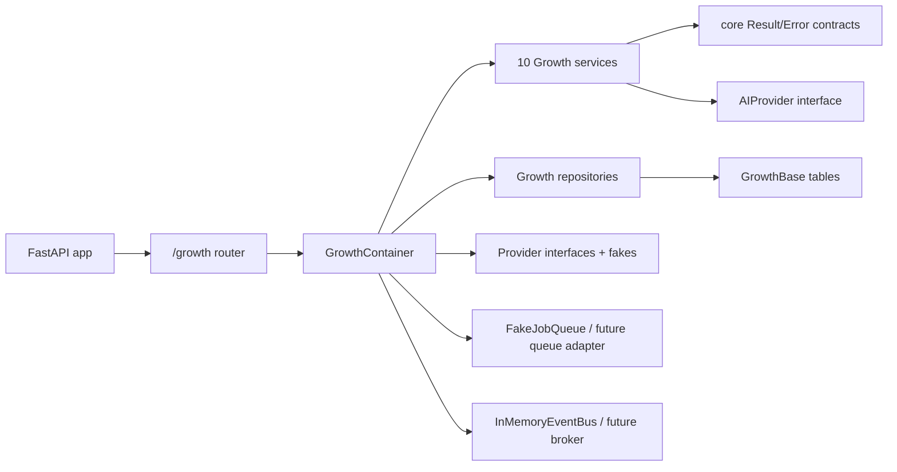
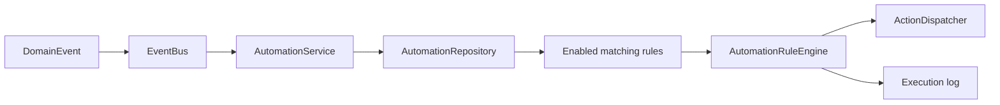
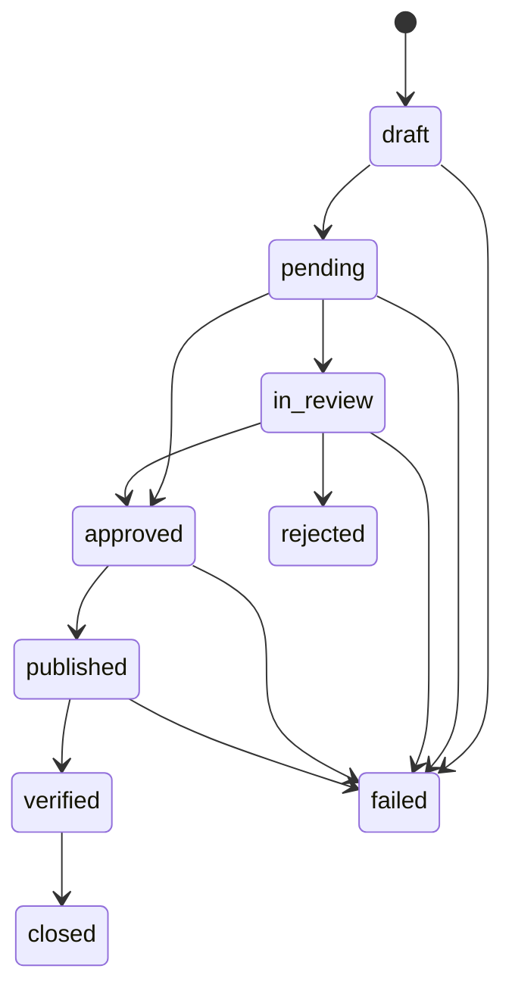

# Milestone 4 - Website Growth Engine

Status: COMPLETE for the in-repo, provider-ready implementation. External paid/credentialed adapters remain plug-in points behind typed provider interfaces.

Full checkpoint: `uv run pytest -q` -> 616 passed, 4 warnings.

## What Was Completed

Milestone 4 adds the Growth package as an additive layer on top of Milestones 1-3. It does not replace the crawl, governance, intelligence, or engine subsystems.

Completed capabilities:

- Growth composition root: `growth.api.wiring.GrowthContainer` wires all Growth services, repositories, fake providers, job queue, event bus, and action dispatcher.
- Growth FastAPI router: `growth.api.routes_growth.build_growth_router()` exposes executable routes under `/growth`.
- App integration: `api.app.create_app(..., growth=...)` mounts injected Growth containers. Production auto-mount is opt-in via `GROWTH_ENGINE_ENABLED=true` to avoid creating GrowthBase tables in the Digital Twin migration schema by surprise.
- Versioned report persistence works for Content Optimization, Local SEO, Reputation, and Outreach through `GrowthRepoMixin` with Pydantic `TypeAdapter` support for dataclasses and Pydantic models.
- Rank Tracking is runnable end to end: add tracked keyword -> capture provider-backed ranking snapshot -> assemble report and visibility trend.
- Automation is runnable end to end: create rule -> publish event -> dispatch action -> persist execution log.
- Reporting is runnable: assemble referenced engine sections, generate AI narrative via the shared AI provider interface, render deterministic output bytes, and persist report artifacts.
- Analytics now reads deterministic provider data instead of returning an empty scaffold.
- Content Optimization now computes deterministic snippet, PAA, intent, EEAT, and transparent score outputs.

## Architecture

Milestone 4 keeps the same dependency direction as prior milestones:

- `core` remains the innermost contract package.
- `growth` depends on `core`, `intelligence`, and `engines` contracts.
- `api` is the composition root that can mount Growth additively.
- Growth persistence uses its own `GrowthBase`, separate from Digital Twin, Intelligence, and Engines metadata.

## Ten Engines

1. Content Generation: AI-backed `ContentAsset` drafts with governance states from `draft` through `verified`.
2. Content Optimization: deterministic snippet/PAA/intent/EEAT scoring layered over upstream M2/M3 outputs.
3. Local SEO: real NAP consistency checking plus provider-backed GBP/citation architecture.
4. Reputation Management: provider-backed review ingestion with AI sentiment/response generation through the M2 AI interface.
5. Rank Tracking: tracked keyword config, provider-backed snapshot capture, append-only time series, visibility reports.
6. Reporting: synthesis-only report artifact generation, no independent metric recomputation.
7. Agency Management: organization/client/team/workspace/task/notification models and persistence foundation.
8. Analytics Intelligence: provider-backed traffic/search snapshot summary and trend export.
9. Outreach: campaign/prospect report architecture behind outreach provider contracts.
10. Automation: generic event -> condition -> action rules with dispatch and execution logs.

## Provider Status

- Real deterministic logic: Local SEO NAP consistency, Content Optimization scoring, Rank Tracking time-series assembly, Automation rule evaluation.
- AI-backed through existing provider abstraction: Content Generation, Reputation sentiment/response drafts, Reporting narrative summaries.
- Fake provider implementations included: Local SEO, Reputation, Analytics, Rank Tracking, Outreach.
- Real adapter integration points are explicit in provider interfaces for Google Analytics, Google Search Console, SERP providers, Yext/BrightLocal-style local SEO providers, review providers, and outreach/contact providers.

## API Surface

New Growth APIs include:

- `POST /growth/content-generation/generate`
- `GET /growth/content-generation/assets/{asset_id}`
- `GET /growth/content-generation/sites/{site_id}/assets`
- `POST /growth/content-generation/assets/{asset_id}/submit|approve|reject|publish|verify`
- `POST /growth/content-optimization/pages/{page_id}/analyze`
- `GET /growth/content-optimization/pages/{page_id}/reports/latest`
- `POST /growth/local-seo/sites/{site_id}/analyze`
- `GET /growth/local-seo/sites/{site_id}/reports/latest`
- `POST /growth/reputation/sites/{site_id}/analyze`
- `GET /growth/reputation/sites/{site_id}/reports/latest`
- `POST /growth/rank-tracking/sites/{site_id}/keywords`
- `POST /growth/rank-tracking/sites/{site_id}/capture`
- `GET /growth/rank-tracking/sites/{site_id}/report`
- `POST /growth/rank-tracking/sites/{site_id}/schedule`
- `POST /growth/reporting/sites/{site_id}/generate`
- `GET /growth/reporting/artifacts/{artifact_id}`
- `POST /growth/analytics/sites/{site_id}/analyze`
- `POST /growth/outreach/sites/{site_id}/analyze`
- `POST /growth/automation/rules`
- `GET /growth/automation/sites/{site_id}/rules`
- `DELETE /growth/automation/rules/{rule_id}`
- `POST /growth/automation/events`
- `GET /growth/automation/sites/{site_id}/execution-log`

## Database Changes

Growth uses `GrowthBase` and `create_growth_tables()` with these tables:

- `growth_content_assets`
- `growth_content_optimization_reports`
- `growth_local_seo_reports`
- `growth_reputation_reports`
- `growth_ranking_snapshots`
- `growth_tracked_keywords`
- `growth_report_artifacts`
- `growth_analytics_snapshots`
- `growth_outreach_reports`
- `growth_organizations`
- `growth_clients`
- `growth_teams`
- `growth_workspaces`
- `growth_tasks`
- `growth_notifications`
- `growth_automation_rules`
- `growth_automation_execution_logs`

These are not Alembic-managed in the Digital Twin migration chain. Production creation is opt-in with `GROWTH_ENGINE_ENABLED=true` or by explicitly building/injecting a `GrowthContainer`.

## Background Jobs And Automation

Scheduled jobs are registered for:

- daily, weekly, and monthly rank tracking capture
- daily analytics snapshot capture
- weekly scheduled report generation

The current queue implementation is `FakeJobQueue`, which is synchronous and deterministic for tests. A Celery/RQ/Temporal adapter can be plugged in behind `JobQueue`.

## ContentAsset Governance

## Developer Guides

### Add A New Content Asset Type

1. Add the enum value to `ContentAssetType`.
2. Add it to `ASSET_TYPES_REQUIRING_REVIEW` if editorial review is required.
3. Ensure `ContentGenerationService.generate()` prompt context includes any type-specific constraints.
4. Add API/test coverage for generation and governance transition behavior.

### Add A New Automation Action

1. Add a Pydantic action model in `automation_rule_engine.py` with a stable `action_type`.
2. Add the type to `AutomationAction` and `_ACTION_MAP`.
3. Implement dispatch behavior in an `ActionDispatcher` subclass.
4. Add a rule/evaluation/logging test.

### Plug In A Real Provider Adapter

1. Implement the relevant provider protocol in `growth.shared.provider_abstraction`.
2. Return `Result[Ok(...), Err(GrowthDataProviderError)]`; never leak credentials in errors.
3. Inject the adapter in `build_growth_container()` or a production-specific container factory.
4. Keep fake providers in tests so the suite remains hermetic.

## UI Changes

No frontend application exists in this repository, so Milestone 4 added API-ready backend surfaces only. The routes are documented by FastAPI OpenAPI when mounted.

## Test Coverage

Added `packages/growth/tests/test_growth_api.py` covering:

- Growth router mounting and Local SEO report persistence/readback.
- Rank Tracking keyword -> capture -> report flow.
- Automation rule -> event -> dispatch log flow.

Final checkpoint:

- `uv run pytest packages/growth/tests/test_growth_api.py -q` -> 3 passed.
- `uv run pytest packages/digital_twin/tests/test_migration_sync.py -q` -> 2 passed.
- `uv run pytest -q` -> 616 passed, 4 warnings.

## Remaining Work

- Implement live adapters for GA/GSC, local listing providers, review providers, SERP rank providers, and outreach providers when credentials are available.
- Add Alembic migrations for GrowthBase if Growth tables should be managed in the same deployment process as Digital Twin tables.
- Build frontend dashboards and workflows on top of the Growth APIs.
- Replace `FakeJobQueue` and `InMemoryEventBus` with production queue/broker adapters for multi-process deployments.